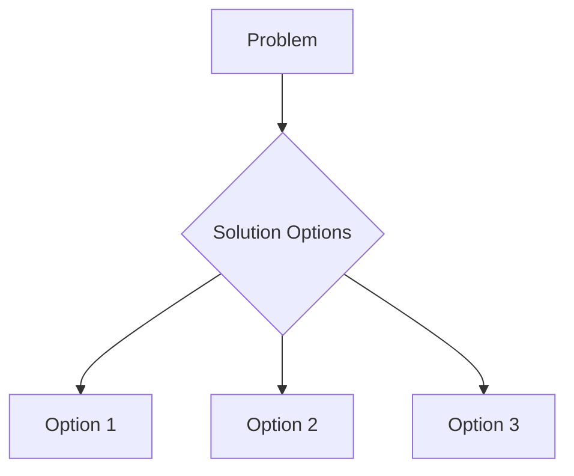

# Brainstorm Workflow

Use this workflow when you need to explore ideas, solutions, or approaches before coding.

// turbo-all

## Steps

### Phase 1: Define Context

1. Clarify the problem or goal:
```
What problem are we solving?
What are the constraints?
What does success look like?
```

### Phase 2: Divergent Thinking (Expand)

2. Generate multiple solutions without filtering:
```
- List at least 5-10 different approaches
- Include unconventional ideas
- No criticism at this stage
- Consider: What would a 10x solution look like?
```

3. Apply brainstorming techniques:
   - **Reverse thinking**: What would make this fail?
   - **Analogies**: How do other domains solve this?
   - **SCAMPER**: Substitute, Combine, Adapt, Modify, Put to other uses, Eliminate, Reverse

### Phase 3: Convergent Thinking (Focus)

4. Evaluate and rank ideas:
```
| Idea | Feasibility (1-5) | Impact (1-5) | Effort (1-5) | Score |
|------|------------------|--------------|--------------|-------|
```

5. Select top 2-3 approaches for deeper analysis

### Phase 4: Visualize

6. Create diagram if helpful:


### Phase 5: Document Decision

7. Write recommendation with:
   - **Chosen approach**: What and why
   - **Trade-offs**: Pros and cons considered
   - **Next steps**: Actionable items

## Output Format

```markdown
## 🧠 Brainstorm: [Topic]

### Problem Statement
[1-2 sentences]

### Ideas Generated
1. ...
2. ...
3. ...

### Evaluation Matrix
| Idea | Feasibility | Impact | Effort |
|------|-------------|--------|--------|

### Recommendation
[Chosen approach with reasoning]

### Next Steps
- [ ] ...
- [ ] ...
```

## Tips

- 💡 Quantity over quality initially
- 🚫 Defer judgment in divergent phase
- 🎯 Be decisive in convergent phase
- 📝 Document rationale for future reference
