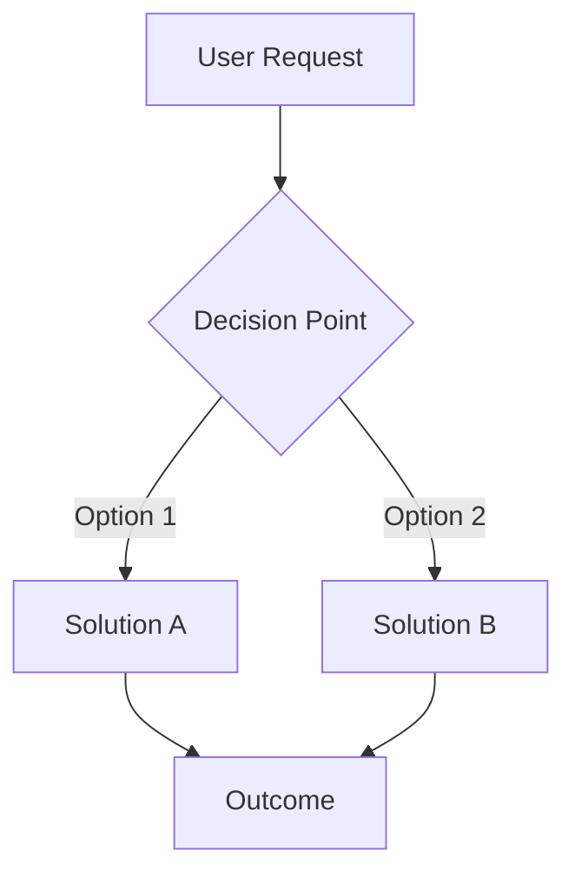
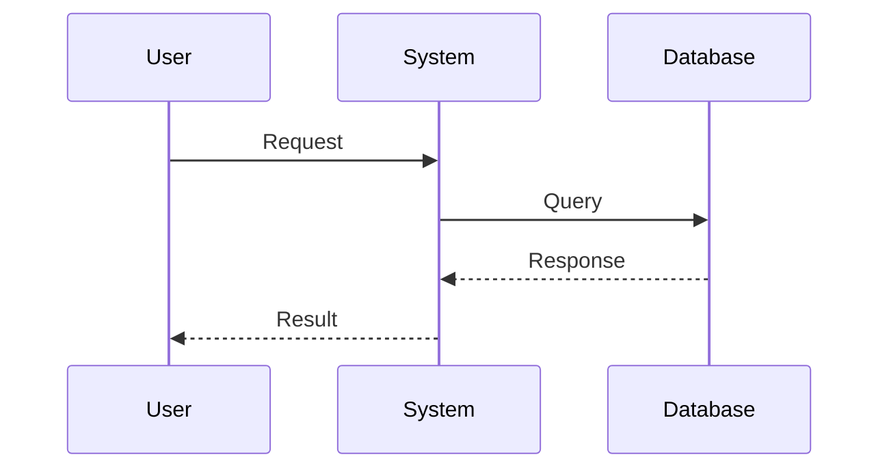

# Brainstorm Workflow

A comprehensive workflow for creative problem-solving and ideation before coding. Based on the Osborn-Parnes Creative Problem Solving model with 30+ validated brainstorming techniques.

// turbo-all

---

## Overview

```
┌─────────────┐    ┌─────────────┐    ┌─────────────┐    ┌─────────────┐    ┌─────────────┐
│   CLARIFY   │───▶│   IDEATE    │───▶│   EVALUATE  │───▶│  VISUALIZE  │───▶│   DECIDE    │
│  (Define)   │    │ (Diverge)   │    │ (Converge)  │    │  (Diagram)  │    │  (Document) │
└─────────────┘    └─────────────┘    └─────────────┘    └─────────────┘    └─────────────┘
```

---

## Phase 1: Clarify the Problem

Before generating ideas, deeply understand what you're solving.

### Step 1.1: Problem Statement

Write a clear, concise problem statement:

```
Problem: [What is the specific problem or opportunity?]
Context: [What is the background? Why does this matter?]
Constraints: [What are the limitations? (time, budget, tech stack)]
Success Criteria: [What does a successful solution look like?]
```

### Step 1.2: Starbursting (6 Questions)

Explore the problem from all angles using the 6 fundamental questions:

```
WHO is affected by this problem?
WHAT exactly needs to be solved?
WHEN does this problem occur?
WHERE does this problem manifest?
WHY is this problem happening?
HOW is this currently being handled?
```

### Step 1.3: The 5 Whys

Drill down to the root cause by asking "Why?" repeatedly:

```
1. Why is [problem] happening?
   → Because [reason 1]
2. Why is [reason 1] happening?
   → Because [reason 2]
3. Why is [reason 2] happening?
   → Because [reason 3]
4. Why is [reason 3] happening?
   → Because [reason 4]
5. Why is [reason 4] happening?
   → Because [ROOT CAUSE]
```

---

## Phase 2: Ideate (Divergent Thinking)

**Goal:** Generate as many ideas as possible. Quantity over quality.

**Rules for Divergent Phase:**
- ✅ Defer judgment - no criticism
- ✅ Go for wild ideas
- ✅ Build on others' ideas
- ✅ Aim for quantity (10+ ideas minimum)

### Step 2.1: Classic Brainstorm

Rapid "idea dump" - list every possible solution without filtering:

```
Ideas:
1. 
2. 
3. 
4. 
5. 
6. 
7. 
8. 
9. 
10.
... (keep going!)
```

### Step 2.2: SCAMPER Technique

Force new perspectives by applying each SCAMPER prompt:

| Letter | Prompt | Applied to your problem |
|--------|--------|------------------------|
| **S** Substitute | What can you substitute? (components, materials, people) | |
| **C** Combine | What can you combine or merge? | |
| **A** Adapt | What can you adapt from another domain/solution? | |
| **M** Modify | What can you magnify, minimize, or modify? | |
| **P** Put to other uses | Can this be used for something else? | |
| **E** Eliminate | What can you remove or simplify? | |
| **R** Reverse | What if you did the opposite? Rearranged? | |

### Step 2.3: Reverse Brainstorming

Instead of solving the problem, brainstorm how to CAUSE or WORSEN it:

```
How could we make this problem WORSE?
1. 
2. 
3. 

Now reverse each to find solutions:
1. (opposite of above)
2. 
3. 
```

### Step 2.4: Analogies & Cross-Domain Thinking

Look for inspiration from other domains:

```
How does NATURE solve similar problems?
→ 

How does [DIFFERENT INDUSTRY] handle this?
→ 

What would [TECH GIANT: Google/Apple/Amazon] do?
→ 

What would a 10x solution look like (if resources were unlimited)?
→ 
```

### Step 2.5: Six Thinking Hats

Examine the problem from 6 different perspectives:

| Hat | Focus | Your thoughts |
|-----|-------|---------------|
| ⚪ White | Facts & Data - What do we know? | |
| ❤️ Red | Emotions & Intuition - What feels right? | |
| ⚫ Black | Caution & Risks - What could go wrong? | |
| 💛 Yellow | Optimism & Benefits - What are the advantages? | |
| 💚 Green | Creativity - New ideas and alternatives | |
| 🔵 Blue | Process - Summary and next steps | |

### Step 2.6: Rolestorming / Figurestorming

Brainstorm from different personas:

```
What would a JUNIOR DEVELOPER suggest?
→ 

What would a SENIOR ARCHITECT recommend?
→ 

What would the END USER want?
→ 

What would a SECURITY EXPERT warn about?
→ 
```

---

## Phase 3: Evaluate (Convergent Thinking)

**Goal:** Narrow down to the best ideas systematically.

### Step 3.1: Affinity Grouping

Cluster related ideas into themes:

```
Theme 1: [Name]
- Idea A
- Idea B

Theme 2: [Name]
- Idea C
- Idea D

Theme 3: [Name]
- Idea E
```

### Step 3.2: Evaluation Matrix

Score each promising idea (1-5 scale):

| Idea | Feasibility | Impact | Effort | Risk | Total |
|------|-------------|--------|--------|------|-------|
| | /5 | /5 | /5 | /5 | /20 |
| | /5 | /5 | /5 | /5 | /20 |
| | /5 | /5 | /5 | /5 | /20 |

**Scoring Guide:**
- **Feasibility**: Can we do this with current resources/skills?
- **Impact**: How much value does this deliver?
- **Effort**: How much work is required? (5 = low effort)
- **Risk**: What's the risk level? (5 = low risk)

### Step 3.3: Trade-off Analysis

For top 2-3 ideas, analyze trade-offs:

```
Option A: [Name]
✅ Pros:
  - 
  - 
❌ Cons:
  - 
  - 

Option B: [Name]
✅ Pros:
  - 
  - 
❌ Cons:
  - 
  - 
```

---

## Phase 4: Visualize

Create diagrams to communicate the solution clearly.

### Step 4.1: Solution Architecture (if applicable)



### Step 4.2: Sequence Diagram (for flows)



---

## Phase 5: Decide & Document

### Step 5.1: Decision Record

Document the decision using ADR format:

```markdown
## Decision: [Title]

### Status
[Proposed | Accepted | Deprecated | Superseded]

### Context
[What is the situation that requires a decision?]

### Options Considered
1. [Option A] - [Brief description]
2. [Option B] - [Brief description]
3. [Option C] - [Brief description]

### Decision
[Which option was chosen and why?]

### Consequences
- [Positive consequence 1]
- [Positive consequence 2]
- [Potential risk or trade-off]

### Next Steps
- [ ] [Action item 1]
- [ ] [Action item 2]
```

---

## Quick Reference: Technique Selector

| Situation | Recommended Technique |
|-----------|----------------------|
| Need many ideas fast | Classic Brainstorm, Crazy Eights |
| Stuck in conventional thinking | Reverse Brainstorming, SCAMPER |
| Need to understand problem deeply | 5 Whys, Starbursting |
| Want diverse perspectives | Six Thinking Hats, Rolestorming |
| Evaluating options | Evaluation Matrix, Trade-off Analysis |
| Team collaboration | Brainwriting, Round Robin |
| Complex architecture | Mermaid Diagrams, ADR |

---

## Output Template

```markdown
# 🧠 Brainstorm: [Topic]

## Problem Statement
[1-2 sentences describing the problem]

## Key Insights from Clarify Phase
- [Insight 1]
- [Insight 2]

## Ideas Generated
### Top Ideas (ranked)
1. **[Idea Name]** - [Brief description]
2. **[Idea Name]** - [Brief description]
3. **[Idea Name]** - [Brief description]

### Other Ideas Explored
- [Idea 4]
- [Idea 5]
- ...

## Evaluation Summary
| Idea | Feasibility | Impact | Effort | Risk | Total |
|------|-------------|--------|--------|------|-------|

## Recommendation
**Chosen Approach:** [Name]

**Rationale:** [Why this approach was selected]

**Trade-offs Accepted:** [What we're giving up]

## Next Steps
- [ ] [Action 1]
- [ ] [Action 2]
- [ ] [Action 3]
```

---

## Tips for Effective Brainstorming

### Do's ✅
- 💡 Quantity breeds quality - generate many ideas first
- 🚫 Defer judgment during ideation
- 🔄 Iterate - revisit and refine
- 📝 Document everything for future reference
- ⏱️ Time-box each phase (15-30 min per phase)
- 🎯 Stay focused on the problem statement

### Don'ts ❌
- ❌ Don't criticize during divergent phase
- ❌ Don't stop at the first good idea
- ❌ Don't skip the clarify phase
- ❌ Don't forget to document the decision rationale
- ❌ Don't ignore unconventional ideas too quickly
