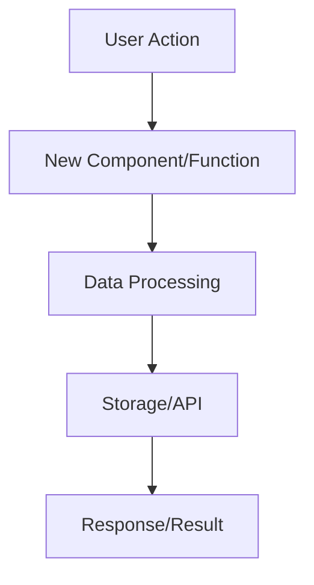
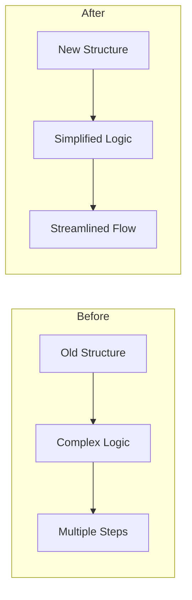
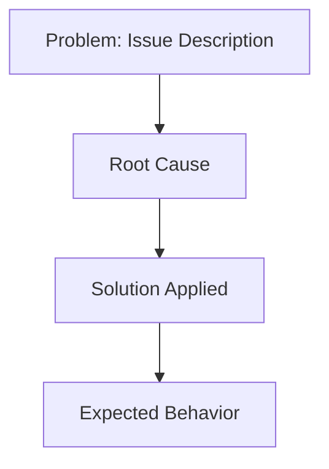
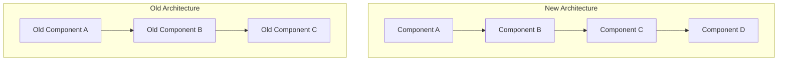

# Generate Release Notes Workflow

// turbo-all

## Overview

This workflow guides AI to create detailed, developer-friendly documentation for code changes. It analyzes commits, explores the codebase thoroughly, detects impacts and breaking changes, then generates comprehensive release notes with visual diagrams.

**Output:** Markdown documentation explaining WHAT changed, WHY it changed, and HOW it impacts the codebase.

---

## Input Required

Before starting, ask the user for:
- **Branch name** (e.g., `feature/new-authentication`) OR
- **Commit hash** (e.g., `abc123def456`) OR
- **Commit range** (e.g., `main..feature-branch` or `abc123..def456`)

---

## Phase 1: Git Analysis 🔍

### Step 1.1: Get Changed Files and Commits

```bash
# If branch name provided
git diff main...<BRANCH_NAME> --name-status

# If commit hash provided
git show <COMMIT_HASH> --name-status

# If commit range provided
git diff <START_COMMIT>..<END_COMMIT> --name-status
```

### Step 1.2: Get Full Diff

```bash
# Get the actual code changes
git diff main...<BRANCH_NAME>

# Or for commit
git show <COMMIT_HASH>
```

### Step 1.3: Identify Change Type

Based on file changes and code analysis, classify as:
- **Feature** - New functionality added
- **Fix** - Bug fix or correction
- **Refactor** - Code restructuring without behavior change
- **Enhancement** - Improvement to existing feature
- **Breaking** - Changes that break existing API/behavior
- **Chore** - Maintenance, deps updates, etc.

---

## Phase 2: Code Exploration 📚

### Step 2.1: Read All Changed Files

Use the Read tool to thoroughly read each changed file:
- Understand the purpose of each change
- Note new functions, classes, interfaces
- Identify modified APIs or signatures

### Step 2.2: Discover Related Files

For each changed file, find related code:

```bash
# Find files that import this file
grep -r "import.*from.*<FILENAME>" --include="*.ts" --include="*.tsx" --include="*.js"

# Find files that export to this file
grep -r "export.*<FUNCTION_NAME>" --include="*.ts" --include="*.tsx"
```

Use Grep tool to search for:
- Function/class usage across codebase
- Import statements
- Related interfaces/types
- Configuration references

### Step 2.3: Understand Context

Read related files to understand:
- How changed code integrates with existing system
- What modules depend on changed code
- What patterns are being followed
- Architecture and design decisions

---

## Phase 3: Impact Analysis ⚡

### Step 3.1: Detect Breaking Changes

Check for breaking changes by comparing:
- **API Signatures**: Function parameters added/removed/changed
- **Return Types**: Different return types
- **Interfaces**: Required fields added, fields removed
- **Exports**: Removed exports, renamed exports
- **Dependencies**: Major version bumps
- **Configuration**: Required new env vars, config changes

### Step 3.2: Find Affected Areas

Identify impact on:
- **Direct Callers**: Files that import/use changed code
- **Downstream Effects**: What breaks if this changes
- **Database**: Schema changes, migrations needed
- **APIs**: Endpoint changes, response format changes
- **UI/UX**: User-facing changes
- **Tests**: Test updates needed

### Step 3.3: Identify Migration Needs

If breaking changes exist, determine:
- What code needs to be updated
- What configuration changes are required
- What data migrations are needed
- What deprecation warnings to add

---

## Phase 4: Diagram Generation 📊

### Step 4.1: Choose Diagram Type Based on Change Type

**For Features:**


**For Refactors (Before/After):**


**For Fixes:**


**For Architecture Changes:**


### Step 4.2: Generate Specific Diagrams

Create 1-3 Mermaid diagrams that show:
- **User/Data Flow**: How data moves through the system
- **Component Interaction**: How components interact
- **Before/After**: What changed architecturally
- **Decision Tree**: Logic flow for complex changes

**Guidelines:**
- Keep diagrams simple and focused
- Use clear, descriptive labels
- Show only relevant components
- Highlight what changed (use different colors if needed)

---

## Phase 5: Documentation Writing 📝

### Step 5.1: Generate Release Notes Document

Create a markdown document with the following structure:

```markdown
# Release Notes: [Feature/Fix Name]

## 📋 Summary

**Change Type:** [Feature/Fix/Refactor/Enhancement/Breaking]
**Branch/Commit:** `[branch-name or commit-hash]`
**Author:** [Author name from git log]
**Date:** [Date]

### What Changed
[2-3 sentences explaining WHAT was changed]

### Why This Change
[2-3 sentences explaining WHY this change was needed - business reason, technical debt, bug impact, etc.]

---

## 🎯 Changes Overview

### Key Changes
- **[Area 1]**: [Description of changes]
- **[Area 2]**: [Description of changes]
- **[Area 3]**: [Description of changes]

### Files Modified
- `path/to/file1.ts` - [What changed in this file]
- `path/to/file2.ts` - [What changed in this file]

---

## ⚠️ Breaking Changes

[If no breaking changes, write "None"]

[If breaking changes exist:]

### 1. [Breaking Change Title]

**What broke:** [Description]

**Before:**
[Small code snippet ONLY if absolutely necessary - show old API]

**After:**
[Small code snippet ONLY if absolutely necessary - show new API]

**Impact:** [Who/what is affected]

---

## 🔄 Migration Guide

[If no migration needed, write "No migration required"]

[If migration needed:]

### For [Affected Group - e.g., "API Consumers", "Frontend Developers"]

1. **[Step 1 Title]**
   - [Action to take]
   - [Why this is needed]

2. **[Step 2 Title]**
   - [Action to take]
   - [Code example only if critical]

3. **[Step 3 Title]**
   - [Action to take]

### Checklist
- [ ] Update imports from old to new paths
- [ ] Replace deprecated functions with new ones
- [ ] Update configuration files
- [ ] Run database migrations
- [ ] Update tests

---

## 💥 Impact on Codebase

### Direct Impact
- **[Module/Component 1]**: [How it's affected]
- **[Module/Component 2]**: [How it's affected]

### Indirect Impact
- **[System Area 1]**: [Potential side effects]
- **[System Area 2]**: [Potential side effects]

### Dependencies Updated
[If dependencies changed:]
- `package-name`: `old-version` → `new-version` - [Why updated]

---

## 📊 Visual Diagrams

### [Diagram 1 Title - e.g., "New Authentication Flow"]

```mermaid
[Insert Mermaid diagram here based on Phase 4]
```

**Explanation:** [2-3 sentences explaining what the diagram shows]

### [Diagram 2 Title - e.g., "Architecture Before/After"]

```mermaid
[Insert Mermaid diagram here]
```

**Explanation:** [2-3 sentences explaining the changes]

---

## 🧪 Testing Recommendations

### Areas to Test
- **[Test Area 1]**: [What to test and why]
- **[Test Area 2]**: [What to test and why]
- **[Test Area 3]**: [What to test and why]

### Test Scenarios
1. [Scenario 1 description]
2. [Scenario 2 description]
3. [Edge case scenario]

### Regression Testing
- [ ] Test [existing feature that might be affected]
- [ ] Verify [integration point]
- [ ] Check [edge case]

---

## 🔗 Related

- **Related PRs:** [Link to related PRs if any]
- **Issues:** Closes #[issue-number] / Fixes #[issue-number]
- **Documentation:** [Link to updated docs if any]
- **Follow-up Work:** [Any follow-up tasks needed]

---

## 💡 Additional Notes

[Any additional context, caveats, or important information]

### Known Limitations
- [Limitation 1]
- [Limitation 2]

### Future Improvements
- [Potential improvement 1]
- [Potential improvement 2]

```

### Step 5.2: Writing Guidelines

**DO:**
- ✅ Explain WHY changes were made (business/technical reasoning)
- ✅ Focus on impact and implications, not implementation details
- ✅ Use clear, simple language that any developer can understand
- ✅ Show code snippets ONLY when absolutely necessary (API signatures, breaking changes)
- ✅ Use bullet points and short paragraphs
- ✅ Include Mermaid diagrams to visualize complex flows
- ✅ Provide actionable migration steps
- ✅ Highlight what developers need to know/do

**DON'T:**
- ❌ Include large code blocks or implementation details
- ❌ Use technical jargon without explanation
- ❌ Show code when a description is sufficient
- ❌ Skip the WHY to only focus on WHAT
- ❌ Forget to mention breaking changes or migration needs
- ❌ Create generic or vague descriptions

---

## Phase 6: Review & Finalize ✅

### Step 6.1: Self-Review Checklist

Before presenting the release notes, verify:
- [ ] All breaking changes are documented
- [ ] Migration guide is provided if needed
- [ ] Diagrams accurately represent the changes
- [ ] Code snippets are minimal and only when necessary
- [ ] WHY is explained, not just WHAT
- [ ] Impact on codebase is clear
- [ ] Testing recommendations are specific
- [ ] Language is clear and developer-friendly

### Step 6.2: Output the Documentation

Present the complete release notes markdown to the user with:
- A brief summary of what was analyzed
- The full documentation
- Any concerns or areas that need user clarification

---

## Example Usage

### Example 1: Feature Branch
```
User: Generate release notes for feature/oauth-integration
AI: [Follows all 6 phases to generate comprehensive docs]
```

### Example 2: Commit Hash
```
User: Generate release notes for abc123def456
AI: [Analyzes single commit and generates focused docs]
```

### Example 3: Commit Range
```
User: Generate release notes for main..develop
AI: [Analyzes all commits in range and generates comprehensive docs]
```

---

## Tips for AI

1. **Be Thorough**: Don't skip the code exploration phase - read ALL related files
2. **Think Like a Developer**: What would YOU want to know if reviewing this PR?
3. **Detect Breaking Changes**: Look for API signature changes, removed exports, interface changes
4. **Visual First**: If a flow is complex, create a diagram instead of describing it
5. **Minimal Code**: Only show code when it's critical to understanding (API changes, breaking changes)
6. **Context Matters**: Explain why the change matters to the project/users
7. **Be Specific**: Instead of "files were updated", say "Authentication middleware was updated to support OAuth 2.0"

---

## Notes

- Requires git to be available in the project
- Focus on code analysis, not commit messages (commits are often incomplete or superficial)
- May need user clarification for ambiguous changes
- Always explore the codebase thoroughly before writing docs
- Use Grep/Read tools extensively to understand impact
- Focus on developer experience - what do they NEED to know?
