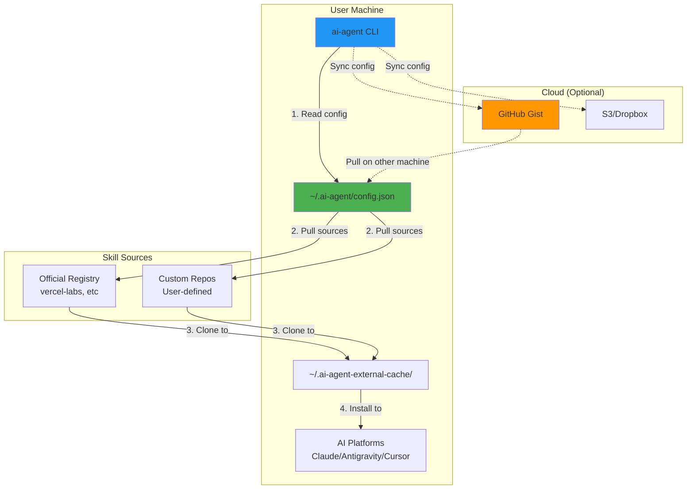
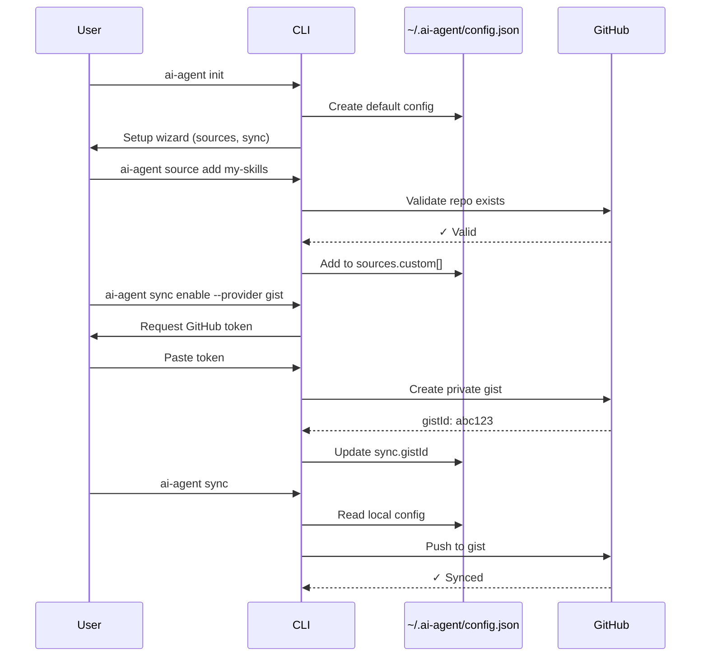

# 🚀 Brainstorm: ai-agent-config v2.0 - Open & Flexible Architecture

**Date:** 2026-01-28
**Goal:** Refactor ai-agent-config để mở và linh hoạt hơn - cho phép user tự config skills từ internet thay vì hard-code, và đồng bộ config qua cloud

---

## Phase 0: Warm-up

**Opposite Day Exercise**: Thay vì package quy định skills → User tự chọn skills họ muốn
**Constraints**: Nếu chỉ có 1 file config → Sẽ làm gì? → JSON config file!

---

## Phase 1: Research - Phân Tích Hiện Trạng

### 1.1 Current Architecture Analysis

**Cách hiện tại hoạt động:**
- Package có **hard-coded** `.agent/external-skills.json` với 4 nguồn cố định
- File này nằm TRONG package, user không thể tùy chỉnh
- `external-sync.js:10` đọc từ `CONFIG_FILE = path.join(__dirname, "../../.agent/external-skills.json")`
- Sync từ 4 repos: Vercel Labs, Everything Claude Code, Playwright, NestJS

**Vấn đề:**
- ✗ User không thể thêm skills từ nguồn khác
- ✗ Phải đợi maintainer chấp nhận PR để thêm nguồn mới
- ✗ Config cố định trong package code
- ✗ Không có cơ chế chia sẻ config giữa các máy

### 1.2 Research Existing Solutions

**1. NPM Config Pattern (npm, eslint, prettier)**
```json
// ~/.ai-agent/config.json hoặc ~/.ai-agentrc
{
  "sources": [...]
}
```

**2. Git-based Sync (VSCode Settings Sync, mackup)**
- Sync config qua GitHub Gist
- Sync qua private repo

**3. Cloud Sync Services**
- Firebase/Supabase cho realtime sync
- S3/Cloud Storage cho file-based sync

**4. Dotfiles Pattern**
- User có thể fork và customize
- Symlink từ home directory

### 1.3 Best Practices Discovered

| Pattern | Pros | Cons |
|---------|------|------|
| **Local config file** | Simple, no internet needed | No sync across machines |
| **Cloud-based config** | Auto-sync, backup | Requires auth, privacy concerns |
| **Git-based config** | Version control, shareable | Manual sync, git knowledge needed |
| **Hybrid (local + cloud)** | Best of both worlds | More complex |

---

## Phase 2: Confirm Understanding ✅

### Tóm tắt yêu cầu:

Refactor **ai-agent-config** để:

1. **Mở hơn**:
   - User tự config skills từ bất kỳ GitHub repo nào
   - Không cứng nhắc vào 4 nguồn hiện tại
   - Có thể thêm/xóa/sửa nguồn skills dễ dàng

2. **Kiến trúc mới**:
   - Package CHỈ cung cấp 2 skills cốt lõi:
     - ✅ Skill 1: Config management (quản lý file JSON config)
     - ✅ Skill 2: Update/sync skills (có sẵn rồi - external-sync)
   - Config file JSON nằm ở `~/.ai-agent/config.json` (user space)
   - User tự define skills muốn pull về

3. **Cloud sync** (bonus):
   - Đồng bộ config giữa nhiều máy
   - Backup & restore
   - Share config với team

**User Confirmation:** ✅ Đúng rồi, tiếp tục Phase 3

---

## Phase 3: Clarify - Deep Dive

### 3.1 Problem Statement (Refined)

**Problem:** Package hiện tại quá cứng nhắc - hard-coded 4 nguồn skills, user không thể tùy chỉnh hay thêm skills từ nguồn riêng

**Context:**
- Community đang phát triển nhiều skills mới
- Mỗi team/developer có nhu cầu skills khác nhau
- Hiện tại phải đợi PR được merge để có skill mới

**Root Cause:** Config nằm TRONG package code thay vì user space

**Constraints:**
- **HARD**: Phải backward compatible (không phá vỡ users hiện tại)
- **HARD**: Zero dependencies policy
- **SOFT**: Cloud sync là optional feature
- **SOFT**: Giữ CLI interface đơn giản

**Success Metrics:**
- ✅ User có thể thêm custom skill source trong < 2 phút
- ✅ Config có thể share được (export/import)
- ✅ Cloud sync hoạt động tự động trong background
- ✅ 100% existing users không bị break

### 3.2 The 5 Whys

1. **Why cứng nhắc?** → Config hard-coded trong package
2. **Why config hard-coded?** → Không có user config mechanism
3. **Why không có user config?** → Package design ban đầu chỉ nghĩ đến curated skills
4. **Why chỉ curated skills?** → Muốn đảm bảo quality
5. **ROOT CAUSE:** Trade-off giữa quality control vs flexibility → Cần hybrid approach

### 3.3 Gap Analysis

| Aspect | Current | Desired | Gap | Action |
|--------|---------|---------|-----|--------|
| Config location | In package code | User home dir | No user config file | Create `~/.ai-agent/config.json` |
| Skill sources | 4 hard-coded | Unlimited custom | No add/remove mechanism | CLI commands to manage sources |
| Sharing | Copy-paste JSON | Export/Import + Cloud | No sync mechanism | Add sync commands |
| Extensibility | Need PR to add source | User self-serve | Closed system | Open architecture |
| Quality control | All curated | Mixed (official + custom) | Loss of curation | Add "official" vs "custom" tags |

---

## Phase 4: Ideate - Solution Ideas

### 4.1 Classic Brainstorm - 15 Ideas

1. **User config file** `~/.ai-agent/config.json` với sources list
2. **Tiered config**: System (curated) + User (custom) configs merge
3. **CLI commands**: `ai-agent add-source`, `remove-source`, `list-sources`
4. **Config wizard**: Interactive TUI để setup config lần đầu
5. **Template marketplace**: Pre-made configs cho different use cases
6. **Git-based sync**: Push/pull config to GitHub Gist
7. **Cloud provider agnostic**: Support nhiều backends (S3, GCS, Dropbox)
8. **Config profiles**: Dev profile, work profile, personal profile
9. **Skill ratings**: Community voting cho custom sources
10. **Auto-discovery**: Scan GitHub topics `ai-agent-skill`
11. **Config validation**: JSON schema + health checks
12. **Migration tool**: Auto migrate từ v1 sang v2
13. **Encrypted cloud sync**: E2E encryption cho sensitive configs
14. **Team sharing**: Share config URL với team
15. **Version control**: Track config changes with rollback

### 4.2 SCAMPER Analysis

| Technique | Application | Ideas |
|-----------|-------------|-------|
| **Substitute** | Thay hard-coded → user-defined | Config file in home dir |
| **Combine** | Merge official + custom sources | Hybrid catalog system |
| **Adapt** | Borrow từ npm/git config | `~/.ai-agentrc` hoặc `config.json` |
| **Modify** | Minimize package → maximize flexibility | Package = engine only, content = user choice |
| **Put to use** | Cloud sync cho team collaboration | Shared team configs |
| **Eliminate** | Remove hard-coded sources từ package | Move to default config template |
| **Reverse** | Instead of pull model → push suggestions | AI suggests skills based on project |

### 4.3 Cross-Domain Thinking

**From NPM ecosystem:**
- `.npmrc` config file pattern
- `npm config set/get` commands
- Global vs local config hierarchy

**From Git:**
- Remote management (`git remote add/remove`)
- Config scopes (system/global/local)
- Push/pull sync model

**From VSCode:**
- Settings Sync extension (GitHub auth)
- Settings JSON schema validation
- Extension marketplace pattern

**From Password Managers:**
- E2E encryption for sensitive data
- Multi-device sync
- Master password protection

---

## Phase 5: Evaluate - Top Solutions

### 5.1 Affinity Grouping

**Theme 1: Config Architecture** 🏗️
- User config file `~/.ai-agent/config.json`
- Tiered system: Official defaults + User overrides
- JSON Schema validation

**Theme 2: CLI Management** 💻
- `ai-agent source add <repo> <branch> <path>`
- `ai-agent source remove <name>`
- `ai-agent source list`
- `ai-agent init` (wizard)

**Theme 3: Cloud Sync** ☁️
- GitHub Gist backend (simple, familiar)
- Firebase/Supabase backend (realtime)
- File-based (S3/Dropbox) backend
- E2E encryption option

**Theme 4: Quality & Discovery** ⭐
- Official registry (curated)
- Community marketplace
- Skill ratings/reviews
- Auto-discovery via GitHub topics

### 5.2 Prioritization Matrix

|  | Easy to Implement | Hard to Implement |
|--|-------------------|-------------------|
| **High Value** | ⭐ **User config file**<br>⭐ **Source management CLI**<br>⭐ **Migration tool** | 📋 **Cloud sync (GitHub Gist)**<br>📋 **Config profiles** |
| **Low Value** | 📝 Config wizard<br>📝 JSON schema validation | ❌ Community marketplace<br>❌ AI skill suggestions |

### 5.3 Evaluation Scoring

| Solution | Feasibility /5 | Impact /5 | Effort /5 | Risk /5 | Total /20 |
|----------|----------------|-----------|-----------|---------|-----------|
| **User config file** | 5 | 5 | 5 | 5 | **20** ⭐ |
| **Source management CLI** | 5 | 5 | 4 | 4 | **18** ⭐ |
| **GitHub Gist sync** | 4 | 4 | 3 | 3 | **14** 📋 |
| **Tiered config (official+custom)** | 4 | 5 | 4 | 4 | **17** ⭐ |
| **Migration tool** | 5 | 4 | 4 | 5 | **18** ⭐ |
| **Firebase/Supabase sync** | 3 | 4 | 2 | 2 | **11** |
| **Community marketplace** | 2 | 3 | 1 | 2 | **8** |
| **Config profiles** | 3 | 3 | 3 | 4 | **13** |

### 5.4 MoSCoW Prioritization

**MUST Have (MVP v2.0):**
- ✅ User config file `~/.ai-agent/config.json`
- ✅ CLI: `source add/remove/list`
- ✅ Migration từ v1 → v2 (auto-detect)
- ✅ Backward compatibility
- ✅ Config export/import

**SHOULD Have (v2.1):**
- ⭐ GitHub Gist sync
- ⭐ Config validation (JSON schema)
- ⭐ Official registry (web UI)

**COULD Have (v2.2+):**
- 💡 Config profiles
- 💡 Skill ratings
- 💡 Auto-discovery

**WON'T Have (out of scope):**
- ❌ Community marketplace with payments
- ❌ AI-powered skill suggestions
- ❌ Complex team permissions

### 5.5 Trade-off Analysis - Top 3 Solutions

#### Option 1: User Config File + CLI Management ⭐ RECOMMENDED

```json
// ~/.ai-agent/config.json
{
  "version": "2.0",
  "sources": {
    "official": [
      // Curated sources (can be disabled)
      { "name": "vercel-labs", "repo": "...", "enabled": true }
    ],
    "custom": [
      // User-added sources
      { "name": "my-team-skills", "repo": "github.com/myteam/skills", "branch": "main" }
    ]
  },
  "sync": {
    "enabled": false,
    "provider": "gist",
    "gistId": "abc123"
  }
}
```

**✅ Pros:**
- Simple, familiar pattern (like .npmrc, .gitconfig)
- User has full control
- Easy to share (copy file)
- Backward compatible (defaults to official sources)
- Zero dependencies

**❌ Cons:**
- Manual sync (need to copy file between machines)
- No built-in quality control for custom sources

**⚠️ Risks → 🔧 Mitigations:**
- Risk: Users add malicious sources → Mitigation: Warning messages, validation
- Risk: Config corruption → Mitigation: Config backup, validation on load
- Risk: Complex for beginners → Mitigation: `ai-agent init` wizard, good defaults

---

#### Option 2: GitHub Gist Sync

```bash
ai-agent sync enable --provider gist
# Prompts for GitHub token, creates private gist
# Auto-syncs config every 5 minutes
```

**✅ Pros:**
- Familiar (GitHub account)
- Free, unlimited gists
- Version history built-in
- Public/private options
- Can share gist URL

**❌ Cons:**
- Requires GitHub token
- Internet dependency
- Privacy concerns for sensitive configs

**⚠️ Risks → 🔧 Mitigations:**
- Risk: Token leakage → Mitigation: Store in system keychain, read-only scope
- Risk: Gist conflicts → Mitigation: Last-write-wins + conflict notifications
- Risk: Rate limiting → Mitigation: Exponential backoff, local cache

---

#### Option 3: Hybrid Tiered System

```
Config Resolution Order:
1. ~/.ai-agent/config.json (user overrides)
2. ~/.ai-agent/official.json (synced from package)
3. Package defaults (fallback)
```

**✅ Pros:**
- Best of both worlds (curation + flexibility)
- Official sources updated via package
- User overrides take precedence
- Clear separation of concerns

**❌ Cons:**
- More complex mental model
- Merge conflicts possible
- Harder to debug "where did this come from?"

---

## Phase 6: Visualize - Architecture Diagrams

### 6.1 New Architecture Flow



### 6.2 Config Management Commands



### 6.3 File Structure - Before vs After

**BEFORE (v1.x):**
```
package/
├── .agent/
│   ├── external-skills.json  ❌ Hard-coded in package
│   └── skills/               ❌ Bundled with package
└── scripts/
    └── external-sync.js      ❌ Reads from package dir
```

**AFTER (v2.0):**
```
~/.ai-agent/                  ✅ User space
├── config.json               ✅ User-editable config
├── official.json             ✅ Synced from package (defaults)
└── cache/                    ✅ Downloaded sources

package/
├── config/
│   └── official-sources.json ✅ Curated defaults
├── scripts/
│   ├── config-manager.js     ✅ NEW: Config CRUD
│   ├── sync-manager.js       ✅ NEW: Cloud sync
│   └── external-sync.js      ✅ Updated: Read from ~/.ai-agent
└── skills/
    ├── config-manager/       ✅ NEW: Skill to manage config
    └── skill-updater/        ✅ Enhanced version of update-skills
```

---

## Phase 7: Decide & Document

### 🎯 Recommended Solution: **Hybrid Progressive Enhancement**

**Phase 1 (MVP - v2.0):** User Config + CLI Management
**Phase 2 (v2.1):** GitHub Gist Sync
**Phase 3 (v2.2+):** Advanced features (profiles, marketplace)

---

## 📦 Implementation Plan - v2.0 MVP

### New Package Structure

```
ai-agent-config/
├── .agent/
│   ├── skills/
│   │   ├── config-manager/          ✨ NEW SKILL
│   │   │   ├── SKILL.md
│   │   │   └── examples/
│   │   └── skill-updater/           ✨ ENHANCED
│   │       └── SKILL.md
│   └── config/
│       └── official-sources.json    ✨ NEW (moved from external-skills.json)
│
├── package/
│   ├── bin/cli.js                   🔧 Enhanced
│   ├── scripts/
│   │   ├── config-manager.js        ✨ NEW
│   │   ├── sync-manager.js          ✨ NEW (for v2.1)
│   │   ├── external-sync.js         🔧 Updated
│   │   ├── installer.js
│   │   └── migration.js             ✨ NEW
│   └── test/
│       ├── config-manager.test.js   ✨ NEW
│       └── migration.test.js        ✨ NEW
```

---

## 🛠️ Core Components

### 1. User Config Schema (`~/.ai-agent/config.json`)

```json
{
  "$schema": "https://ai-agent-config.dev/schema/v2.json",
  "version": "2.0",

  "sources": {
    "official": [
      {
        "name": "vercel-labs",
        "repo": "https://github.com/vercel-labs/agent-skills.git",
        "branch": "main",
        "enabled": true,
        "skills": [
          { "path": "skills/react-best-practices", "name": "react-best-practices" }
        ]
      }
    ],

    "custom": [
      {
        "name": "my-company-skills",
        "repo": "https://github.com/mycompany/ai-skills.git",
        "branch": "main",
        "enabled": true,
        "skills": [
          { "path": "skills/company-standards", "name": "company-standards" }
        ],
        "metadata": {
          "description": "Company internal coding standards",
          "tags": ["company", "private"],
          "addedAt": "2026-01-28T10:00:00Z"
        }
      }
    ]
  },

  "sync": {
    "enabled": false,
    "provider": null,
    "config": {}
  },

  "preferences": {
    "autoUpdate": true,
    "updateInterval": "weekly"
  }
}
```

### 2. New CLI Commands

```bash
# Setup & Initialization
ai-agent init                          # Interactive setup wizard
ai-agent migrate                       # Migrate from v1 to v2

# Source Management
ai-agent source add <repo> [options]   # Add custom source
ai-agent source remove <name>          # Remove source
ai-agent source list                   # List all sources
ai-agent source enable <name>          # Enable source
ai-agent source disable <name>         # Disable source
ai-agent source info <name>            # Show source details

# Config Management
ai-agent config get <key>              # Get config value
ai-agent config set <key> <value>      # Set config value
ai-agent config edit                   # Open config in editor
ai-agent config validate               # Validate config
ai-agent config export [file]          # Export config
ai-agent config import <file>          # Import config
ai-agent config reset                  # Reset to defaults

# Sync (v2.1)
ai-agent sync enable --provider gist   # Enable GitHub Gist sync
ai-agent sync disable                  # Disable sync
ai-agent sync push                     # Push local config to cloud
ai-agent sync pull                     # Pull cloud config to local
ai-agent sync status                   # Show sync status

# Existing commands (updated)
ai-agent install                       # Install from config
ai-agent sync-external                 # Renamed to: update
ai-agent list                          # List installed skills
```

### 3. Skill 1: `config-manager` (NEW)

**Purpose:** Help AI agents manage user config interactively

**SKILL.md:**
```markdown
# Config Manager Skill

Help users manage their ai-agent-config configuration.

## When to use this skill
- User wants to add a new skill source
- User needs to configure sync settings
- User wants to share their config with team
- User asks "how do I add a custom skill?"

## Capabilities
- Add/remove skill sources
- Validate GitHub repos
- Export/import configs
- Enable/disable sources
- Explain config options

## Examples

User: "Add skills from my company repo"
→ Guide them through `ai-agent source add` command
→ Validate repo exists
→ Show what skills will be available

User: "I want to share my config with my team"
→ Explain export/import
→ Show how to use GitHub Gist sync
→ Provide example workflow
```

### 4. Skill 2: `skill-updater` (ENHANCED)

**Enhanced from existing `update-skills`:**

```markdown
# Skill Updater

Automatically update skills from all configured sources.

## New Features (v2.0)
- Updates from BOTH official and custom sources
- Reads from `~/.ai-agent/config.json`
- Shows which sources were updated
- Handles custom source errors gracefully

## Usage
```bash
ai-agent update [--source <name>] [--force]
```

## AI Agent Usage
When user asks to "update my skills", run:
- Check `~/.ai-agent/config.json` for enabled sources
- Pull latest from each repo
- Install to AI platforms
- Report what changed
```

### 5. Migration Strategy

**Auto-migration on first run (v2.0):**

```javascript
// package/scripts/migration.js

async function migrateV1toV2() {
  const configPath = path.join(os.homedir(), '.ai-agent', 'config.json');

  // Check if already migrated
  if (fs.existsSync(configPath)) {
    return { migrated: false, reason: 'Already on v2' };
  }

  console.log('🔄 Migrating to v2.0...\n');

  // Create ~/.ai-agent/ directory
  const configDir = path.dirname(configPath);
  fs.mkdirSync(configDir, { recursive: true });

  // Load official sources from package
  const officialSources = loadOfficialSources();

  // Create default config
  const config = {
    version: '2.0',
    sources: {
      official: officialSources.map(s => ({ ...s, enabled: true })),
      custom: []
    },
    sync: { enabled: false },
    preferences: { autoUpdate: true, updateInterval: 'weekly' }
  };

  // Write config
  fs.writeFileSync(configPath, JSON.stringify(config, null, 2));

  console.log('✅ Migration complete!');
  console.log(`   Config created: ${configPath}`);
  console.log('\n💡 Tips:');
  console.log('   - Add custom sources: ai-agent source add <repo>');
  console.log('   - Enable cloud sync: ai-agent sync enable --provider gist');

  return { migrated: true };
}
```

---

## 🎯 Key Design Principles

1. **Progressive Enhancement**: v1 users auto-migrate, v2 is additive
2. **Zero Breaking Changes**: All existing commands still work
3. **Sensible Defaults**: Works out-of-box with official sources
4. **User Control**: Config file is human-readable JSON
5. **CLI-First**: All features accessible via commands
6. **AI-Friendly**: Skills help agents guide users

---

## 📋 Implementation Checklist - v2.0 MVP

**Config System:**
- [ ] Create `~/.ai-agent/config.json` schema
- [ ] Implement `config-manager.js` module
- [ ] Add JSON schema validation
- [ ] Support config export/import
- [ ] Write migration script (v1 → v2)

**CLI Commands:**
- [ ] `ai-agent init` - Setup wizard
- [ ] `ai-agent source add/remove/list`
- [ ] `ai-agent config get/set/edit`
- [ ] `ai-agent migrate` - Manual migration trigger
- [ ] Update existing `install` command to read from user config

**Skills:**
- [ ] Create `config-manager` skill
- [ ] Enhance `skill-updater` skill
- [ ] Update documentation in both skills

**External Sync:**
- [ ] Update `external-sync.js` to read from `~/.ai-agent/config.json`
- [ ] Support both official + custom sources
- [ ] Add source validation (check repo exists)

**Testing:**
- [ ] Unit tests for config-manager
- [ ] Integration tests for migration
- [ ] E2E test: add custom source → sync → install
- [ ] Test backward compatibility

**Documentation:**
- [ ] Update README with v2 features
- [ ] Migration guide (v1 → v2)
- [ ] Custom source examples
- [ ] Troubleshooting guide

**Release:**
- [ ] Bump version to 2.0.0
- [ ] Write changelog
- [ ] Update NPM package
- [ ] Announce migration path

---

## 📋 Implementation Checklist - v2.1 (Cloud Sync)

**GitHub Gist Sync:**
- [ ] Implement `sync-manager.js` module
- [ ] Add `ai-agent sync enable --provider gist`
- [ ] GitHub token authentication (store in keychain)
- [ ] Auto-sync on config changes (debounced)
- [ ] Conflict resolution (last-write-wins)
- [ ] Sync status indicator

**Security:**
- [ ] Store tokens in system keychain (macOS/Linux/Windows)
- [ ] Use minimal GitHub scopes (gist read/write only)
- [ ] Encrypt sensitive config values (optional)
- [ ] Add config.json to .gitignore templates

**Testing:**
- [ ] Mock GitHub API in tests
- [ ] Test sync conflict resolution
- [ ] Test offline behavior
- [ ] Test token expiration handling

---

## 🚀 Future Enhancements (v2.2+)

**Config Profiles:**
```bash
ai-agent profile create work
ai-agent profile switch work
ai-agent profile list
```

**Official Registry (Web UI):**
- Browse curated skills
- One-click add to config
- Community ratings
- Search & filter

**Auto-Discovery:**
```bash
ai-agent discover --topic ai-agent-skill
# Scans GitHub for repos with topic, shows installable skills
```

**Team Features:**
```bash
ai-agent team create myteam
ai-agent team invite user@email.com
ai-agent team sync
# Shared config for entire team
```

---

## ⚠️ Risks & Mitigations

| Risk | Impact | Mitigation |
|------|--------|------------|
| **Config file corruption** | High | Auto-backup before changes, validation on load |
| **Malicious skill sources** | High | Warning on custom sources, sandboxing (future) |
| **GitHub token leakage** | Medium | System keychain storage, minimal scopes |
| **Sync conflicts** | Medium | Last-write-wins + notification, manual merge option |
| **Breaking v1 users** | High | Auto-migration, backward compatibility |
| **Complex for beginners** | Low | Good defaults, `init` wizard, clear docs |

---

## 🎉 Summary

### Recommended Architecture

**v2.0 MVP (Ship first):**
- ✅ User config in `~/.ai-agent/config.json`
- ✅ CLI commands for source management
- ✅ 2 core skills: `config-manager` + `skill-updater`
- ✅ Auto-migration from v1
- ✅ Export/import configs

**v2.1 (Next):**
- ☁️ GitHub Gist sync
- 🔐 Encrypted sync option
- 📊 Sync status & conflict handling

**v2.2+ (Future):**
- 👥 Team sharing
- 🎨 Config profiles
- 🌐 Official registry web UI
- 🔍 Auto-discovery

### Why This Approach?

1. **Solves the core problem**: User flexibility WITHOUT losing curation
2. **Familiar patterns**: Like `.npmrc`, `.gitconfig` → low learning curve
3. **Progressive**: v1 users auto-migrate, no breaking changes
4. **Extensible**: Easy to add cloud sync, profiles, etc. later
5. **Zero deps**: Stays true to project philosophy
6. **Ship fast**: MVP is small, testable, valuable

### Next Steps

1. **Validate with users**: Share this design, get feedback
2. **Prototype MVP**: Build v2.0 core features
3. **Dogfood**: Use it internally, find rough edges
4. **Beta release**: Get early adopters to test
5. **Ship v2.0**: Full release with migration guide
6. **Iterate to v2.1**: Add cloud sync based on demand

---

**Conclusion:** This architecture provides the flexibility users need while maintaining the quality and simplicity that makes ai-agent-config valuable. The phased approach allows for rapid iteration and user feedback.
